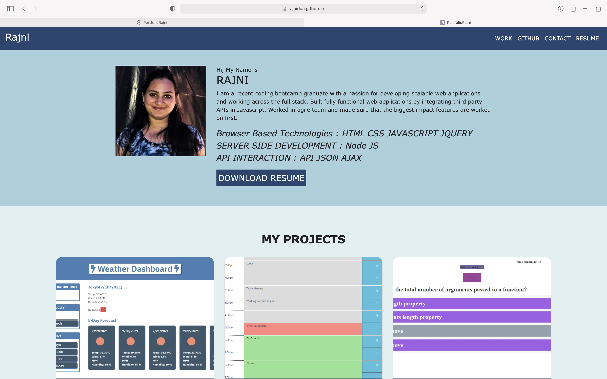

# rajniPortfolio

This is my portfolio project, that shows some of the work that I have done .

When User clicks on the item in the navigation bar,
Then it takes you to the appropriate section

When you hover over the project,
Then it shows you the details about the project

When you click on the project name
Then it takes you to the deployed app

When you click on the github link,
then it takes you to the github link for that project

When you click on the CONTACT DETAIL link in the Get In Touch section,
Then it takes you to conatct details in the footer

When user fills out form with his name ,email id and message,
Then I recieve your email.

## Screenshots

## live URL

https://rajnidua.github.io/rajniPortfolio/

## Lisence & copyright

&copy; Rajni Dua

Licensed under the [MIT License](LICENSE).
